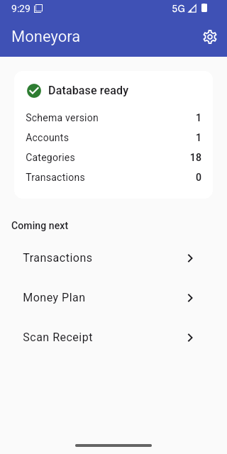

<div align="center">

# Moneyora

**Plan. Track. Thrive.**

A personal finance app that builds your budget from your own spending history
and reads your receipts with the camera — both running entirely on the phone,
with the radio off.

[](https://github.com/SanduniLiyanage/Moneyora/actions/workflows/ci.yml)
[](https://flutter.dev)
[](LICENSE)



<sub>Sprint 1 on an Android emulator — the encrypted database open and seeded.<br>
The entry screen and transaction list landed in Sprint 2.</sub>

</div>

---

## The two features that make it more than an expense tracker

### Money Plan Generator

Most budgeting apps ask you to invent a number for each category and then feel
bad about it. Moneyora reads what you have actually spent and proposes the
budget itself.

It classifies every category from its own history — **fixed** costs like rent
(a coefficient of variation under 0.15), **variable** ones like food,
**seasonal** ones that spike in particular months, and **trending** ones
climbing month over month — then allocates against your income and tells you
how much to trust each figure. A category with three transactions behind it is
reported as low confidence rather than dressed up as a forecast.

All of it is ordinary statistics computed in Dart on the device. Nothing is
sent anywhere, and it works on a plane.

### Receipt Scanner

Photograph a receipt and it is read on-device with Google ML Kit: merchant,
date, total, and line items. A three-layer keyword classifier guesses the
category, and — this is the part that matters — **it learns from your
corrections**, so the guesses improve with use.

No image and no total ever leaves the phone.

---

## What is built today

| Area | Status |
|---|---|
| Encrypted database, schema, migrations, seed data | **Built** |
| Theme, navigation, error handling, CI pipeline | **Built** |
| Transactions — entry keypad, list, filter, edit, undo | **Built** |
| Accounts and transfers — domain and data layers | **Built** |
| Accounts — the side panel of balances | **Built** |
| Accounts — add and edit, with 25 built-in icons | **Built** |
| Accounts — archive, restore and delete | **Built** |
| Transfers — atomic, with the screen that records them | **Built** |
| Analytics — the spending-by-category query | **Built** — domain and data only |
| AI Copilot — agent loop, first tool, model integration | **Built** |
| AI Copilot — the ask screen | **Built** — not yet proven against the live API |
| Categories — custom, hierarchy, inline create | Not started — Sprint 3.5 |
| Analytics — donut chart, trends, heatmap | Not started — Sprint 4 |
| Money Plan Generator | Not started — Sprint 5 |
| Receipt Scanner | Not started — Sprint 6 |
| PIN and biometrics, backup and export | Not started — Sprints 7–8 |

Sprints 1 and 2 of 11 are complete and verified on an Android emulator.
Sprint 3 is all but done — the accounts slice, the side panel, the account form,
archiving, restoring, deleting and the transfer screen are all in, leaving the
entry screen's account selector and the transfer rows' `From`/`To` labels.
Sprint 3.5, categories, is next.

For the current test count, coverage figure and everything else that carries a
number, see [`docs/HANDOFF.md`](docs/HANDOFF.md) — it is the one place they are
recorded, so that they cannot drift apart between documents. It also has what
exists, what is next, and the environment traps.

Everything above works offline. The AI Copilot, cloud backup and live exchange
rates are the only networked features — each optional, each behind a
connectivity check with a fallback, and none of them handling raw financial
data. The Copilot's tools run on-device and send only computed aggregates; see
[`docs/COPILOT.md`](docs/COPILOT.md).

---

## Stack

Flutter · Dart 3 · Riverpod (`AsyncNotifier`) · SQLite + SQLCipher (AES-256) ·
Google ML Kit · fpdart · fl_chart · go_router · Clean Architecture,
feature-first

## Quick start

```powershell
git clone https://github.com/SanduniLiyanage/Moneyora.git
cd Moneyora
.\scripts\bootstrap.ps1     # requires Flutter on PATH — see docs/SETUP.md
flutter run
```

Windows has two traps that will cost you an evening each if you meet them
cold — `PUB_CACHE` must sit on the same drive as the repository, and
`cmdline-tools` is pinned deliberately. Both are documented in
[`docs/SETUP.md`](docs/SETUP.md).

## Repository layout

```
lib/
├── core/          shared: theme, errors, utils, database, router
├── features/      one self-contained module per feature
│   └── <feature>/
│       ├── domain/         pure Dart — entities, contracts, use cases
│       ├── data/           sqflite, ML Kit, http — implements the contracts
│       └── presentation/   Flutter widgets + Riverpod providers
├── main.dart
├── app.dart
└── injection.dart
docs/              guides, plus the approved specifications in docs/specs/
scripts/           bootstrap + architecture boundary checker
test/              mirrors lib/
```

**Dependencies point inward**: `presentation` → `domain` ← `data`, and
`domain/` imports no Flutter and no database. That is what lets the plan engine
be tested without a device, and `scripts/check_architecture.sh` enforces it on
every push rather than trusting anyone to remember.

## Documentation

| Document | Read it when |
|---|---|
| [HANDOFF.md](docs/HANDOFF.md) | **Start here.** Project state, what is next, and the environment traps |
| [SPEC_ERRATA.md](docs/SPEC_ERRATA.md) | **Before implementing any requirement.** Where it and a spec disagree, it wins |
| [SETUP.md](docs/SETUP.md) | Setting up a machine, or a build breaks |
| [ARCHITECTURE.md](docs/ARCHITECTURE.md) | Adding any feature — layer rules and conventions |
| [WORKFLOW.md](docs/WORKFLOW.md) | Branching, commits, releases |
| [ROADMAP.md](docs/ROADMAP.md) | Deciding what to build next |
| [COPILOT.md](docs/COPILOT.md) | Working on the AI Copilot — its scope, privacy design and build order |
| [CLAUDE.md](CLAUDE.md) | Working with Claude Code in this repo |
| [specs/](docs/specs/) | The approved SRS, SDD, DBD and ERD PDFs — unmodified — plus derived, non-authoritative Markdown transcripts for grepping |
| [REQUIREMENTS_INDEX.md](docs/specs/REQUIREMENTS_INDEX.md) | **Before citing an FR-/NFR- ID anywhere.** Every requirement, flat and greppable, with known citation traps |

### On the errata

The four specifications in [`docs/specs/`](docs/specs/) are the approved
baselines and are left exactly as approved. Auditing them before writing the
schema turned up twenty defects, four of which blocked the first sprint
outright — including a `transactions` table in which no transfer could be
inserted, and a plan generator built on `STDDEV()`, which SQLite does not
provide.

Later passes kept finding more, and the interesting ones were found by asking
different questions. One asked what a person meets on first open, and found that
nothing specified an empty state anywhere. One audited the Copilot's own draft
specification against the code, and found three of its five tools wrapped
features that do not exist. One ran the other way entirely — auditing the
*code's* citations against the SRS — and found four requirement IDs naming the
wrong requirements, plus a use case that had shipped with no requirement behind
it at all. One found that eight of the ten account icons the SRS names are other
companies' trademarks. The most recent found a requirement this hardware cannot
verify, and a structural decision recorded nowhere but in one file's own
comment.

Rather than silently editing the specifications, every deviation is recorded in
[`SPEC_ERRATA.md`](docs/SPEC_ERRATA.md) with its reasoning, and folds into v1.1
at milestone M2. One finding was later withdrawn on evidence, which is recorded
there too. **That file carries its own current count and status** — deliberately
not repeated here, since a number restated in three documents goes stale in
three places and then disagrees with itself. The baseline stays auditable; the
corrections stay traceable.

## Platform status

| Platform | Status |
|---|---|
| Android 8.0+ (API 26) | Primary target. Built and run on an emulator. |
| iOS 15.5+ | **Compile-verified only** — CI builds it on macOS every PR, but it has never been run on a device or simulator. Floor raised from the SRS's iOS 14 because ML Kit requires 15.5. See [E-19](docs/SPEC_ERRATA.md), [E-20](docs/SPEC_ERRATA.md). |

The distinction matters: "builds on iOS" and "works on iOS" are different
claims, and only the first is being made.

## Security

Database encrypted with AES-256 (SQLCipher); the key is held in the Android
Keystore / iOS Keychain and never appears in source. Receipt images are stored
in encrypted app-private storage. No financial data leaves the device without
an explicit user action. Optional PIN (4–6 digits, 5-attempt lockout with
exponential backoff) and biometrics.

## Licence

MIT — see [LICENSE](LICENSE).

Built by Sanduni.
