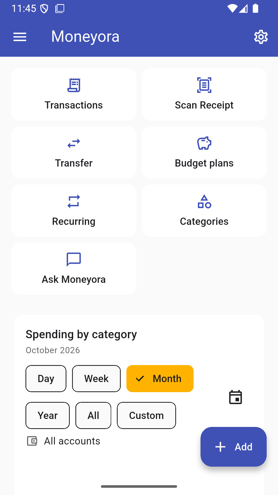
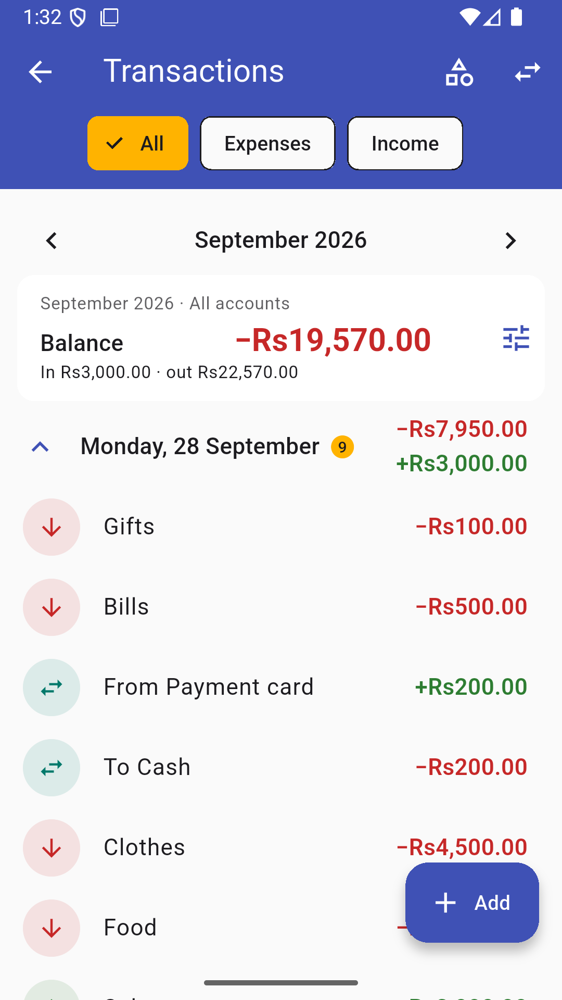
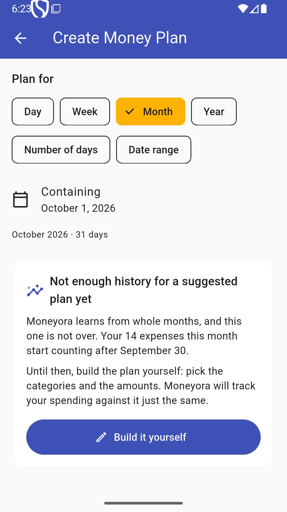

<div align="center">

# Moneyora

**Plan. Track. Thrive.**

A personal finance app that builds your budget from your own spending history
and reads your receipts with the camera — both on the phone, with the radio
off.

[](https://github.com/SanduniLiyanage/Moneyora/actions/workflows/ci.yml)
[](https://github.com/SanduniLiyanage/Moneyora/releases/latest)
[](https://flutter.dev)
[](LICENSE)





</div>

---

## Install

Moneyora is free. Download the APK from the
[latest release](https://github.com/SanduniLiyanage/Moneyora/releases/latest)
and open it on the phone:

- `moneyora-<version>-arm64-v8a.apk` — almost every Android phone from the
  last several years;
- `moneyora-<version>-armeabi-v7a.apk` — older 32-bit phones.

Android asks once to allow installing from your browser or file manager.
Requires Android 8.0 or later.

**Updating:** download the new release's APK and open it. Android offers
**Update** and keeps everything you have recorded. Never uninstall to update:
uninstalling deletes your data, unless you made a backup first (Settings ›
Back up now).

---

## The two features that make it more than an expense tracker

### Money Plan

Most budgeting apps ask you to invent a number for each category. Moneyora
can propose one from what you have actually spent — or you can build the plan
yourself, and it tracks your spending against it either way.

A suggested plan classifies every category from its own history: **fixed**
costs like rent (a coefficient of variation under 0.15), **variable** ones like
food, and **seasonal** ones that spike in particular months. A rising or
falling trend adjusts the figure, and the total can come from your history,
from a figure you set, or from your income less your fixed costs and savings.
Every category says how far to trust it: a figure with little history behind
it is labelled **Low** confidence rather than dressed up as a forecast.

It suggests only from your own spending — at least one whole month and ten
expenses — and never from made-up examples. Until then, you build the plan by
hand.

Following a plan shows each category's spend against its budget, green, yellow
then red, with an optional notification at 80% and at 100%. A category that
goes over offers three answers: take it from the others, take it from one you
choose, or carry it into the next plan.

All of it is ordinary statistics computed in Dart on the device.

### Receipt scanner

Photograph a receipt, or pick one from the gallery, and it is read on the
phone with Google ML Kit: the merchant, the date, the total and each line
item, with discounts taken off the item they belong to. Each line gets a
suggested category from a three-layer classifier — a keyword dictionary, your
own history, and the merchant — and **it learns from your corrections**.
You review everything before a single expense is saved, or file the whole
receipt under one category.

The photo is kept encrypted with the expenses it became, and never leaves the
phone.

---

## Everything else

- **Accounts** — cash, cards and bank accounts, each with its balance; other
  currencies counted at rates you enter.
- **Transfers** between your own accounts, which move each account's balance
  without counting as spending.
- **Recurring** expenses and income, with an optional reminder before each.
- **Categories** you can add, rename, recolour and nest one level deep.
- **Charts** — spending by category, income against expenses, trends over
  time and a spending calendar, for any period and any account.
- **Budget plans** — every plan you have kept, the active one first: rename,
  delete, compare two side by side.
- **Passcode** (4–6 digits, with a lockout that doubles after each wrong try)
  and **biometric unlock**.
- **Encrypted backup** to a file sealed with your password, which any phone
  with Moneyora can restore; **export** to CSV or PDF.
- **Ask Moneyora** — optional questions about your spending, answered by
  Google's Gemini with your own free API key. It sends only your question and
  the category totals it needs, never a transaction.
- Light and dark themes, and screens that hold at the largest text size on a
  phone as narrow as 320 dp.

Everything except Ask Moneyora works with no internet connection at all. What
is stored, and the one case in which anything leaves the phone, is set out in
[`PRIVACY.md`](docs/PRIVACY.md). How to use each screen is in the
[user manual](docs/USER_MANUAL.md).

---

## Security

The database is encrypted with AES-256 (SQLCipher). Its key is held in the
Android Keystore / iOS Keychain and never appears in source. Receipt photos
are encrypted before they are written. No financial data leaves the device
without an explicit action by the user, and there are no analytics and no
crash reporting.

## Platform status

| Platform | Status |
|---|---|
| Android 8.0+ (API 26) | **Released** on [GitHub Releases](https://github.com/SanduniLiyanage/Moneyora/releases). Tested on an emulator and by testers on their own phones. |
| iOS 15.5+ | **Compile-verified only** — CI builds it on macOS for every pull request, but it has never run on a device or simulator. The floor is above the SRS's iOS 14 because ML Kit requires 15.5. See [E-19](docs/SPEC_ERRATA.md), [E-20](docs/SPEC_ERRATA.md). |

"Builds on iOS" and "works on iOS" are different claims, and only the first is
being made.

---

## For developers

### Stack

Flutter · Dart 3 · Riverpod · SQLite + SQLCipher (AES-256) · Google ML Kit
text recognition · fpdart · fl_chart · go_router · flutter_local_notifications
· local_auth · pdf · Clean Architecture, feature-first

### Quick start

```powershell
git clone https://github.com/SanduniLiyanage/Moneyora.git
cd Moneyora
.\scripts\bootstrap.ps1     # requires Flutter on PATH — see docs/SETUP.md
flutter run
```

Windows has two traps that will cost you an evening each if you meet them
cold — `PUB_CACHE` must sit on the same drive as the repository, and
`cmdline-tools` is pinned deliberately. Both are documented in
[`docs/SETUP.md`](docs/SETUP.md).

### Repository layout

```
lib/
├── core/          shared: theme, errors, utils, database, router, ports
├── features/      one self-contained module per feature
│   └── <feature>/
│       ├── domain/         pure Dart — entities, contracts, use cases
│       ├── data/           sqflite, ML Kit, http — implements the contracts
│       └── presentation/   Flutter widgets + Riverpod providers
├── main.dart
├── app.dart
└── injection.dart
docs/              guides, plus the approved specifications in docs/specs/
store/             listing assets: screenshots and the feature graphic
scripts/           bootstrap, and the checks CI runs
test/              mirrors lib/
```

**Dependencies point inward**: `presentation` → `domain` ← `data`, and
`domain/` imports no Flutter and no database. That is what lets the plan engine
be tested without a device, and `scripts/check_architecture.sh` enforces it on
every push rather than trusting anyone to remember.

### Checks

Every pull request runs formatting, `flutter analyze`, the full test suite with
a 75% floor on domain-layer coverage, the layer boundaries, every cited
requirement ID (`scripts/check_citations.sh`), and a release build — the one
that runs the shrinker — which must stay under 80 MB per ABI and keep what the
shrinker would otherwise strip (`scripts/check_proguard.sh`). The current test count and coverage are
recorded in one place, [`docs/HANDOFF.md`](docs/HANDOFF.md), so they cannot
drift apart between documents.

### Documentation

| Document | Read it when |
|---|---|
| [HANDOFF.md](docs/HANDOFF.md) | **Start here.** Project state, what is next, and the environment traps |
| [SPEC_ERRATA.md](docs/SPEC_ERRATA.md) | **Before implementing any requirement.** Where it and a spec disagree, it wins |
| [USER_MANUAL.md](docs/USER_MANUAL.md) | Using the app: every screen, for the person holding the phone |
| [PRIVACY.md](docs/PRIVACY.md) | What the app stores, what can leave the phone and when; the store's privacy policy |
| [RELEASE.md](docs/RELEASE.md) | Publishing a version, and how installed copies update |
| [SETUP.md](docs/SETUP.md) | Setting up a machine, or a build breaks |
| [ARCHITECTURE.md](docs/ARCHITECTURE.md) | Adding any feature — layer rules and conventions |
| [WORKFLOW.md](docs/WORKFLOW.md) | Branching, commits, releases |
| [ROADMAP.md](docs/ROADMAP.md) | Deciding what to build next |
| [COPILOT.md](docs/COPILOT.md) | Working on Ask Moneyora — its scope, privacy design and build order |
| [store/LISTING.md](docs/store/LISTING.md) | The store listing text and the data-safety answers |
| [CLAUDE.md](CLAUDE.md) | Working with Claude Code in this repo |
| [specs/](docs/specs/) | The approved SRS, SDD, DBD and ERD PDFs — unmodified — plus derived, non-authoritative Markdown transcripts for grepping |
| [REQUIREMENTS_INDEX.md](docs/specs/REQUIREMENTS_INDEX.md) | **Before citing an FR-/NFR- ID anywhere.** Every requirement, flat and greppable, with known citation traps |

### On the errata

The four specifications in [`docs/specs/`](docs/specs/) are the approved
baselines and are left exactly as approved. Auditing them before writing the
schema turned up twenty defects, four of which blocked the first sprint
outright — including a `transactions` table in which no transfer could be
inserted, and a plan generator built on `STDDEV()`, which SQLite does not
provide.

Later passes kept finding more, and the interesting ones were found by asking
different questions. One asked what a person meets on first open, and found that
nothing specified an empty state anywhere. One audited the Copilot's own draft
specification against the code, and found three of its five tools wrapped
features that do not exist. One ran the other way entirely — auditing the
*code's* citations against the SRS — and found four requirement IDs naming the
wrong requirements, plus a use case that had shipped with no requirement behind
it at all. One found that eight of the ten account icons the SRS names are other
companies' trademarks.

Rather than silently editing the specifications, every deviation is recorded in
[`SPEC_ERRATA.md`](docs/SPEC_ERRATA.md) with its reasoning, and folds into v1.1
at milestone M2. One finding was later withdrawn on evidence, which is recorded
there too. **That file carries its own current count and status** — deliberately
not repeated here, since a number restated in three documents goes stale in
three places and then disagrees with itself.

## Licence

MIT — see [LICENSE](LICENSE).

Built by Sanduni.
